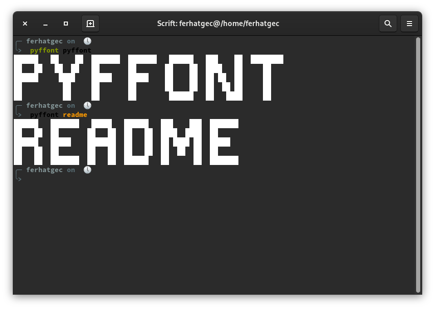

# Fegeya PyFFont
## PyFFont, Python3 implementation of FFont (library, executable)

### Other implementations:
  * [FFont](https://github.com/ferhatgec/ffont)
  * [RustoFont](https://github.com/ferhatgec/rustofont)
  * [Node-FFont](https://github.com/ofsahof/node-ffont)

### PyFFont licensed under the terms of MIT License.
